# AI 构建日志查询项目心路历程

---

## 题目

使用 AI 理解要求，自行构建需求，模仿图片页面，实现一个日志查询项目：

1. 全部的前端组件使用腾讯云tea组件。（）
2. 后台使用 golang 。
3. 数据库使用提供的clickhouse。

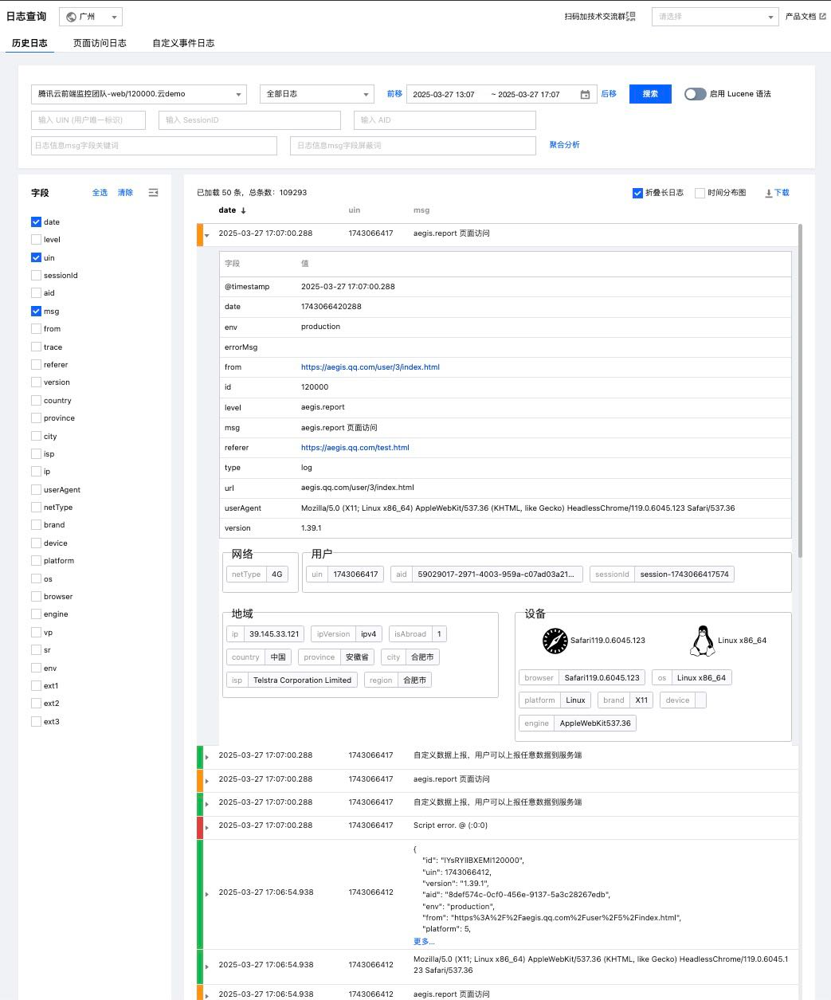

## 个人结合实际分析

1. 搜索发现，腾讯Tea组件是 React 框架下的组件，而我对 React 框架不是很了解，主要熟悉 Vue 框架。
   - 策略1：在 Vue 项目中使用 React 组件。
   - 策略2：快速学习 React 框架基础内容，避免对项目完全看不懂的情况。
   - 按照我的过往经验总结，策略 1 可能具有更多不确定性，所以选择策略 2。
2. 使用 Golang 制作后台，我简单学习过 Golang 与 Gin 框架，所以这一部分应该可以轻松应对。
3. 使用 clickhouse 数据库，通过提供的账号密码远程连接获取数据。
4. 要求使用 AI 构建项目，我可以使用 chatGPT 作为项目前期搭建辅助，后期使用 cursor 来综合阅读项目并进行快速构建。

分析表结构，没有表信息的详细讲解，需要之后编写程序获取返回值以做下一步的分析。

与图片内呈现网页结构，图片中呈现的只有 `历史日志`部分，`页面访问日志`与 `自定义日志`未呈现，应该不用作要求。最顶栏中的地区查询应该也可以搁置。

顶部卡片是收集搜索信息的输入框，由于表结构的信息未讲解，之后先抽取几个数据项作为搜索信息。

按图片表层信息，我目前理解为左栏中的字段被勾选，则右侧列表的列会出现相应字段。

选中右侧列表的列表项后，会显示更详细的信息。

## 实践-前端部分

1. 选择策略 2，花去一部分时间了解 React 框架的基本内容。
2. 先手动构建好项目基本目录。并克隆tea组件库仓库，方便AI阅读并使用。
   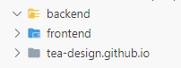
3. 向 AI 讲解基本情况，并要求先按照需求图制作前端。

   > @frontend 此处是我用npm create vite@latest my-app -- --template react构建的前端项目。
   > @backend 这是后端项目位置
   > @tea-design.github.io 这是前端要用到的 腾讯Tea 组件的源码库（我们不是从这里调用组件，而是用npm install tea-component 从外部安装）
   > 数据库采用远程连接clickhouse：
   > 只读账号：----
   > 密码：----
   > 访问链接：----
   > database：test_db
   > table: kv_7
   > 表结构：
   >
   > ```sql
   > CREATE TABLE test_db.kv_7 on cluster default_cluster
   > (
   >     `data_time` DateTime,
   >     `write_time` DateTime MATERIALIZED now(),
   >     `time_hour` String CODEC(ZSTD(9)),
   >     `id` String CODEC(ZSTD(9)),
   >     `time` Int64 CODEC(T64, ZSTD(9)),
   >     `extra` String CODEC(ZSTD(9)),
   >     `entrance_time` Int64 CODEC(Delta(8), ZSTD(9)),
   >     `entrance_id` String CODEC(ZSTD(9)),
   >     `stamp` Int32 CODEC(T64, ZSTD(9)),
   >     `app_id` LowCardinality(String),
   >     `platform` LowCardinality(String) CODEC(ZSTD(9)),
   >     `user_id` String CODEC(ZSTD(9)),
   >     `version` String CODEC(ZSTD(9)),
   >     `build_id` String CODEC(ZSTD(9)),
   >     `device_id` String CODEC(ZSTD(9)),
   >     `model` String CODEC(ZSTD(9)),
   >     `os` LowCardinality(String) CODEC(ZSTD(9)),
   >     `os_ver` String CODEC(ZSTD(9)),
   >     `sdk_ver` LowCardinality(String),
   >     `category` LowCardinality(String),
   >     `action` String,
   >     `label` String,
   >     `state` String,
   >     `value` Int32 CODEC(T64, ZSTD(9)),
   >     `d1` String CODEC(LZ4),
   >     `d2` String CODEC(LZ4),
   >     `d3` String CODEC(LZ4),
   >     `d4` String CODEC(LZ4),
   >     `d5` String CODEC(LZ4),
   >     `d6` String CODEC(LZ4),
   >     `d7` String CODEC(LZ4),
   >     `d8` String CODEC(LZ4),
   >     `d9` String CODEC(LZ4),
   >     `d10` String CODEC(LZ4),
   >     `d11` String CODEC(LZ4),
   >     `d12` String CODEC(LZ4),
   >     `d13` String CODEC(LZ4),
   >     `d14` String CODEC(LZ4),
   >     `d15` String CODEC(LZ4),
   >     `d16` String CODEC(LZ4),
   >     `d17` String CODEC(LZ4),
   >     `d18` String CODEC(LZ4),
   >     `d19` String CODEC(LZ4),
   >     `d20` String CODEC(LZ4),
   >     `d21` String CODEC(LZ4),
   >     `d22` String CODEC(LZ4),
   >     `d23` String CODEC(LZ4),
   >     `d24` String CODEC(LZ4),
   >     `d25` String CODEC(LZ4),
   >     `d26` String CODEC(LZ4),
   >     `d27` String CODEC(LZ4),
   >     `d28` String CODEC(LZ4),
   >     `d29` String CODEC(LZ4),
   >     `d30` String CODEC(LZ4),
   >     `d31` String CODEC(LZ4),
   >     `d32` String CODEC(LZ4),
   >     `d33` String CODEC(LZ4),
   >     `d34` String CODEC(LZ4),
   >     `d35` String CODEC(LZ4),
   >     `d36` String CODEC(LZ4),
   >     `d37` String CODEC(LZ4),
   >     `d38` LowCardinality(String) CODEC(ZSTD(9)),
   >     `d39` LowCardinality(String) CODEC(ZSTD(9)),
   >     `d40` LowCardinality(String) CODEC(ZSTD(9)),
   >     `v1` Int64 CODEC(T64, ZSTD(9)),
   >     `v2` Int64 CODEC(T64, ZSTD(9)),
   >     `v3` Int64 CODEC(T64, ZSTD(9)),
   >     `v4` Int64 CODEC(T64, ZSTD(9)),
   >     `v5` Int64 CODEC(T64, ZSTD(9)),
   >     `v6` Int64 CODEC(T64, ZSTD(9)),
   >     `v7` Int64 CODEC(T64, ZSTD(9)),
   >     `v8` Int64 CODEC(T64, ZSTD(9)),
   >     `v9` Int64 CODEC(T64, ZSTD(9)),
   >     `v10` Int64 CODEC(T64, ZSTD(9)),
   >     `v11` Int64 CODEC(T64, ZSTD(9)),
   >     `v12` Int64 CODEC(T64, ZSTD(9)),
   >     `v13` Int64 CODEC(T64, ZSTD(9)),
   >     `v14` Int64 CODEC(T64, ZSTD(9)),
   >     `v15` Int64 CODEC(T64, ZSTD(9)),
   >     `v16` Int64 CODEC(T64, ZSTD(9)),
   >     `v17` Int64 CODEC(T64, ZSTD(9)),
   >     `v18` Int64 CODEC(T64, ZSTD(9)),
   >     `v19` Int64 CODEC(T64, ZSTD(9)),
   >     `v20` Int64 CODEC(T64, ZSTD(9)),
   >     `v21` Int64 CODEC(T64, ZSTD(9)),
   >     `v22` Int64 CODEC(T64, ZSTD(9)),
   >     `v23` Int64 CODEC(T64, ZSTD(9)),
   >     `v24` Int64 CODEC(T64, ZSTD(9)),
   >     `v25` Int64 CODEC(T64, ZSTD(9)),
   >     `v26` Int64 CODEC(T64, ZSTD(9)),
   >     `v27` Int64 CODEC(T64, ZSTD(9)),
   >     `v28` Int64 CODEC(T64, ZSTD(9)),
   >     `v29` Int64 CODEC(T64, ZSTD(9)),
   >     `v30` Int64 CODEC(T64, ZSTD(9)),
   >     `v31` Int64 CODEC(T64, ZSTD(9)),
   >     `v32` Int64 CODEC(T64, ZSTD(9)),
   >     `v33` Int64 CODEC(T64, ZSTD(9)),
   >     `v34` Int64 CODEC(T64, ZSTD(9)),
   >     `v35` Int64 CODEC(T64, ZSTD(9)),
   >     `v36` Int64 CODEC(T64, ZSTD(9)),
   >     `v37` Int64 CODEC(T64, ZSTD(9)),
   >     `v38` Int64 CODEC(T64, ZSTD(9)),
   >     `v39` Int64 CODEC(T64, ZSTD(9)),
   >     `v40` Int64 CODEC(T64, ZSTD(9)),
   >     `info1` String CODEC(ZSTD(9)),
   >     `info2` String CODEC(ZSTD(9)),
   >     `info3` String CODEC(ZSTD(9)),
   >     `info4` String CODEC(ZSTD(9)),
   >     `info5` String CODEC(ZSTD(9)),
   >     `info6` String CODEC(ZSTD(9)),
   >     `info7` String CODEC(ZSTD(9)),
   >     `info8` String CODEC(ZSTD(9)),
   >     `info9` String CODEC(ZSTD(9)),
   >     `info10` String CODEC(ZSTD(9)),
   >     `ud1` String CODEC(ZSTD(9)),
   >     `ud2` String CODEC(ZSTD(9)),
   >     `ud3` String CODEC(ZSTD(9)),
   >     `ud4` String CODEC(ZSTD(9)),
   >     `ud5` String CODEC(ZSTD(9)),
   >     `ud6` String CODEC(ZSTD(9)),
   >     `ud7` String CODEC(ZSTD(9)),
   >     `ud8` String CODEC(ZSTD(9)),
   >     `ud9` String CODEC(ZSTD(9)),
   >     `ud10` String CODEC(ZSTD(9)),
   >     `ud11` String CODEC(ZSTD(9)),
   >     `ud12` String CODEC(ZSTD(9)),
   >     `ud13` String CODEC(ZSTD(9)),
   >     `ud14` String CODEC(ZSTD(9)),
   >     `ud15` String CODEC(ZSTD(9)),
   >     `ud16` String CODEC(ZSTD(9)),
   >     `ud17` String CODEC(ZSTD(9)),
   >     `ud18` String CODEC(ZSTD(9)),
   >     `ud19` String CODEC(ZSTD(9)),
   >     `ud20` String CODEC(ZSTD(9)),
   >     `uv1` Int64 CODEC(T64, ZSTD(9)),
   >     `uv2` Int64 CODEC(T64, ZSTD(9)),
   >     `uv3` Int64 CODEC(T64, ZSTD(9)),
   >     `uv4` Int64 CODEC(T64, ZSTD(9)),
   >     `uv5` Int64 CODEC(T64, ZSTD(9)),
   >     `uv6` Int64 CODEC(T64, ZSTD(9)),
   >     `uv7` Int64 CODEC(T64, ZSTD(9)),
   >     `uv8` Int64 CODEC(T64, ZSTD(9)),
   >     `uv9` Int64 CODEC(T64, ZSTD(9)),
   >     `uv10` Int64 CODEC(T64, ZSTD(9)),
   >     `sd1` String CODEC(ZSTD(9)),
   >     `sd2` String CODEC(ZSTD(9)),
   >     `sd3` String CODEC(ZSTD(9)),
   >     `sd4` String CODEC(ZSTD(9)),
   >     `sd5` String CODEC(ZSTD(9)),
   >     `sd6` String CODEC(ZSTD(9)),
   >     `sd7` String CODEC(ZSTD(9)),
   >     `sd8` String CODEC(ZSTD(9)),
   >     `sd9` String CODEC(ZSTD(9)),
   >     `sd10` String CODEC(ZSTD(9)),
   >     `sd11` String CODEC(ZSTD(9)),
   >     `sd12` String CODEC(ZSTD(9)),
   >     `sd13` String CODEC(ZSTD(9)),
   >     `sd14` String CODEC(ZSTD(9)),
   >     `sd15` String CODEC(ZSTD(9)),
   >     `sd16` String CODEC(ZSTD(9)),
   >     `sd17` String CODEC(ZSTD(9)),
   >     `sd18` String CODEC(ZSTD(9)),
   >     `sd19` String CODEC(ZSTD(9)),
   >     `sd20` String CODEC(ZSTD(9)),
   >     `sv1` Int64 CODEC(T64, ZSTD(9)),
   >     `sv2` Int64 CODEC(T64, ZSTD(9)),
   >     `sv3` Int64 CODEC(T64, ZSTD(9)),
   >     `sv4` Int64 CODEC(T64, ZSTD(9)),
   >     `sv5` Int64 CODEC(T64, ZSTD(9)),
   >     `sv6` Int64 CODEC(T64, ZSTD(9)),
   >     `sv7` Int64 CODEC(T64, ZSTD(9)),
   >     `sv8` Int64 CODEC(T64, ZSTD(9)),
   >     `sv9` Int64 CODEC(T64, ZSTD(9)),
   >     `sv10` Int64 CODEC(T64, ZSTD(9)),
   >     INDEX device_id_index device_id TYPE bloom_filter GRANULARITY 4,
   >     INDEX user_id_index user_id TYPE bloom_filter GRANULARITY 4,
   >     INDEX model_index model TYPE bloom_filter GRANULARITY 4,
   >     INDEX os_index os TYPE set(1024) GRANULARITY 4,
   >     INDEX d38_index d38 TYPE set(1024) GRANULARITY 4,
   >     INDEX d39_index d39 TYPE set(1024) GRANULARITY 4,
   >     INDEX d40_index d40 TYPE set(1024) GRANULARITY 4,
   >     INDEX os_ver_index os_ver TYPE bloom_filter GRANULARITY 4,
   >     INDEX platform_index platform TYPE set(1024) GRANULARITY 4,
   >     INDEX version_index version TYPE bloom_filter GRANULARITY 4,
   >     INDEX id_index id TYPE bloom_filter GRANULARITY 4
   > )
   > ENGINE = ReplicatedMergeTree('/clickhouse/tables/test_web/kv_7/{shard}', '{replica}')
   > PARTITION BY intDiv(entrance_time, 2592000000)
   > ORDER BY (app_id, category, entrance_time)
   > TTL write_time + toIntervalMonth(1)
   > SETTINGS index_granularity = 8192, ttl_only_drop_parts = 1, use_minimalistic_part_header_in_zookeeper = 1
   >
   > ```
   >
   > 我们位于(C:\Users\86503\Desktop\newtest\AI前端面试题1)
   >
4. 然后，传入图片，并口述页面结构，便于 AI 理解：

   > 先构建前端项目，记得全部组件必须使用tea组件。
   >
   > \## 顶栏是内容筛选的部分
   > \### 第一行
   > 其中第一个框(仅作摆设)：可选内容为 模拟云监控应用-web/120000.zsdemo
   > 第二个框(仅作摆设)：可选内容为 全部日志
   > 第三个框(与date有关)：是一个时间选择框
   > 然后就是搜索按钮
   > \### 第二行
   > 第一个：输入 UIN（用户唯一标识）
   > 第二个：输入 Session ID
   > 第三个：输入 aid
   > \### 第三行
   > 第一个：输入日志信息 msg 关键字段
   > 第二个：输入日志信息 msg 屏蔽字段
   >
   > \## 下面主体部分分为左栏和右边列表
   > \### 左栏包含字段，可勾选（勾选后的字段可在右边列表作为显示出来的列名）
   > \### 右边主体列表，列表中每一项可以展开，未展开时仅显示左栏勾选的字段的信息。展开后会如图显示完整的日志信息。
   >
5. 项目创建后，运行发现一片空白，打开控制台发现很多报错。将报错信息告诉 AI 让其自动调整。
6. 调整后页面显示正常，项目内代码也确实全部由tea组件构成，但与目标页面仍有差距：

   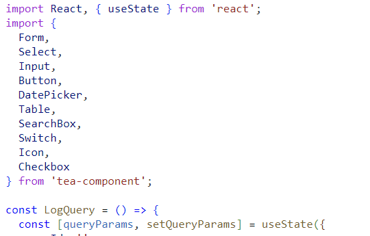

   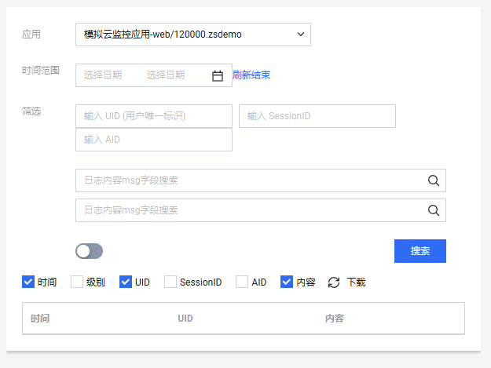
7. 再次上传图片，并且逐步微调，精细化告诉 AI 如何实现效果，最终得到如下基础页面。

   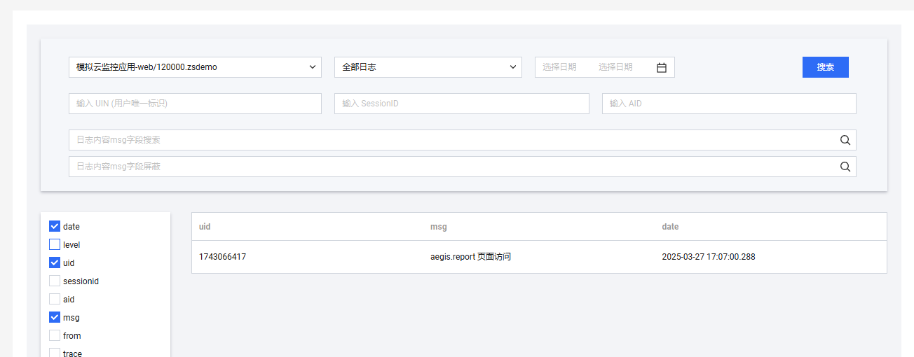

   - AI 生成后，由于其对tea组件库不是十分了解，部分问题需要我自己去查阅资料并解决。
8. 经过一系列手动更改与AI批量生成，实现了目前的基础效果。

   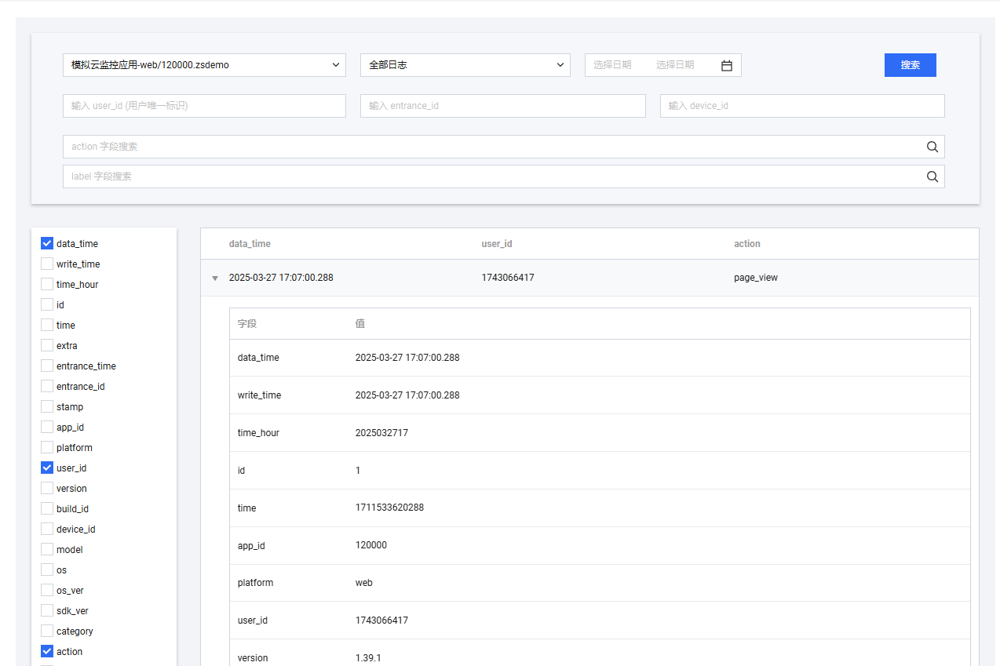

## 实践-数据访问

1. 尝试理解表数据的内容，以便更好指挥 AI。

   1. 询问 chatGPT 制作一个访问 clickhouse 的 Go 程序，但是其似乎对 clickhouse 的 go 库了解甚少，无法生成成功。（直接 Scan 数据到 interface{} 动态存储的话，遇到特殊数据类型立刻报错）
   2. 于是转战搜索相关知识，发现中文互联网对 clickhouse-go 的使用记录也甚少。
   3. 最后自己尝试分析代码，总结方法为制作一个包含所有传入内容所需的数据结构，再调用 `scanStruct()` 避免出错。由于数量巨大，我让 AI 自动化根据表结构生成该数据结构。
   4. 解决该问题耗时较长，但终于能解决，访问到了数据。

      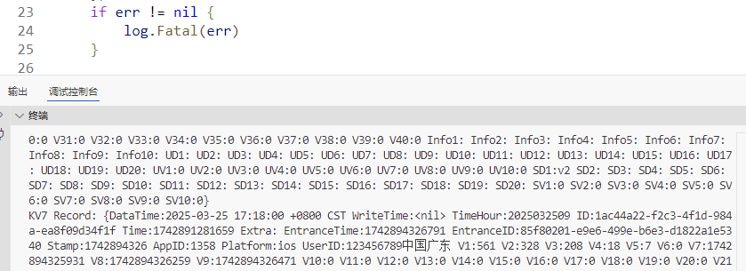
2. 分析数据，存在数据的字段有：

   ```go
   DataTime: 2025-03-25 17:22:00 +0800 CST
   这个字段表示数据记录的时间。
   
   TimeHour: 2025032509
   可能表示某个特定小时的标识（例如：2025032509 表示2025年3月25日的9点）。
   
   ID: 9b467872-3861-4095-90ba-cf9e996e4e3b
   这是该条记录的唯一标识符，通常用UUID表示。
   
   Time: 1742891521659
   可能表示一个时间戳，用于记录某个事件的发生时间。
   
   EntranceTime: 1742894526711
   这个字段可能记录了入口事件的时间戳。
   
   EntranceID: 3e1b862f-7899-4957-b704-8942e6e1757f
   入口的唯一标识符，可能是某个事件或会话的标识。
   
   Stamp: 1742894526
   这个字段可能表示某个特定时间点的时间戳或标记。
   
   AppID: 1358
   表示应用的唯一标识符。
   
   Platform: ios
   表示设备的操作系统平台，这里是 iOS。
   
   UserID: 123456789
   用户的唯一标识符。
   
   Version: 4.2.3
   表示应用的版本号。
   
   BuildID: acd3ed1d-e9f4-430c-9e5c-493273ce5e5b
   表示构建版本的唯一标识符。
   
   DeviceID: 572AB40E-2936-4532-94AF-D0A680A968CF
   设备的唯一标识符。
   
   Model: iPhone 13
   设备的型号。
   
   OS: ios
   表示设备操作系统类型。
   
   OSVer: Version 15.1 (Build 19B74)
   表示设备操作系统的版本号。
   
   SDKVer: 5.4.5
   表示SDK的版本号。
   
   Category: PERF_NET_SSE
   可能是事件的类别或类型，这里表示网络性能相关事件。
   
   Action:
   这个字段没有数据。
   
   Label:
   这个字段没有数据。
   
   State:
   这个字段没有数据。
   
   Value: 0
   可能是某种数值型状态或标记，这里是0，通常表示默认值或未发生特定事件。
   
   D1: http://hunyuanapi.com
   可能是事件相关的URL或API地址。
   
   D2: hunyuanapi.com
   表示与 D1 对应的URL域名部分。
   
   D3: hunyuan
   可能是事件相关的服务或项目名称。
   
   D12: 127.0.0.1
   表示本地地址，通常用于表示本地服务器的IP。
   
   D36: 127.0.0.1
   再次表示本地服务器的IP。
   
   D37: 中国
   表示地理位置，这里是中国。
   
   D38: NoNetwork
   可能表示设备没有连接网络。
   
   D39: 电信
   表示网络运营商，电信公司。
   
   D40: 中国广东
   表示地理位置，具体是中国广东。
   
   V1: 971
   
   V2: 449
   
   V3: 507
   
   V4: 15
   
   V5: 0
   
   V6: 0
   
   V7: 1742894524883
   
   V8: 1742894525332
   
   V9: 1742894525707
   
   SD1: v2
   可能是某个版本号或状态标识符。
   ```

   由于数据没有详细说明，难以理解，只能按表明意思提供给页面。

## 实践-后端部分

1. 将已做好的 go 程序发送给 cursor ，让其联调前端部分完成后端部分，并使用 GIN 框架。
2. 由于之前已经完成了数据库访问部分，后端的完成没有什么阻力

   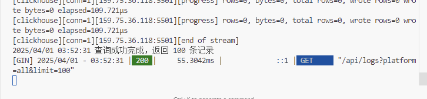
3. 但是前端之后访问数据出现了问题，加入调试信息后，每次都能成功获取数据，但是就是无法访问数据内容（AI无法解决）

   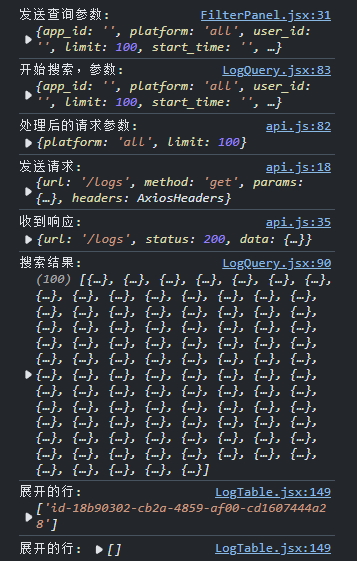
4. 仔细阅读代码后，发现是Key值出现的问题：比如前端要求的数据Key值是 `data_time`，但是后端传过来的数据Key值 `DataTime`，通过在数据结构中加入 `json tag` 得以解决。

## 实践-尾声

19点开始，3点结束，耗时8小时，因为对 React 与 clickhouse 库的不熟悉导致时间稍长。

最终实现效果如下：

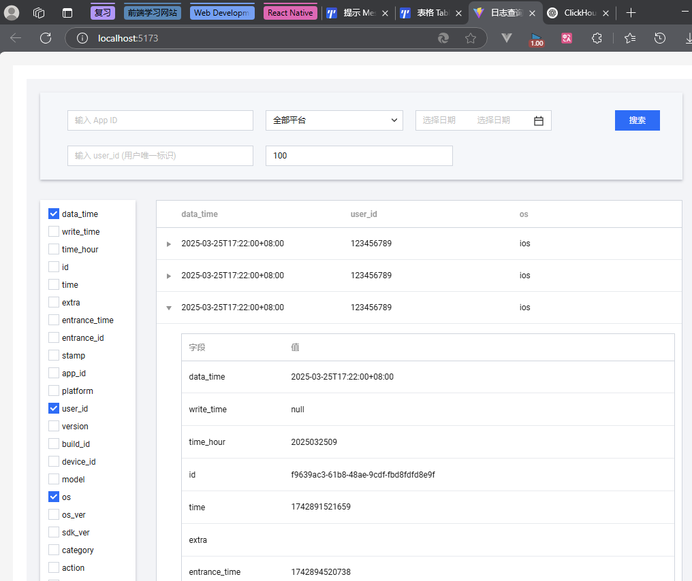

**前端运行**：需安装 `node.js` ，在进入 `frontend` 输入：

```bash
npm install
npm run dev
```

启动成功后，进入返回的 ip 地址即可访问前端

**后端运行**：需按照 `Go` 环境，进入 `backend` 输入

```bash
go get github.com/ClickHouse/clickhouse-go/v2
go get github.com/gin-contrib/cors
go get github.com/gin-gonic/gin
go run ".\main\main.go"
```

之后，通过前端搜索相关信息即可访问日志信息。

## 优化点思考

已实现优化点：

- 使用 constants/index.js 提取出配置字段，对组件进行解耦。
- 优化 table，增加列表排序(点击列头进行排序)，表头显示数据加载状态。
- 使用分页功能，更便利查找日志信息
- 列字段选择设置持久化：使用 localStorage 保存保存用户选择的列设置
- 通过 AI 辅助，对项目进行解耦与简化，更容易维护。
- 虚拟列表无法使用，使用后与列展开存在兼容性问题（如果单页设置访问数据量过大，可以用虚拟列表来进行优化）
- 导出功能：添加导出 Excel 功能，方便用户分析数据。

为节省时间最快完成任务，以下还有部分优化点未实现：

- 字段本地化：目前字段名称显示的是英文，可以添加中文映射。（但这部分需要对表结构有更清楚的认识才可以）
- 时间选择优化：可以添加快捷时间选项（如今天、昨天、最近7天等）。

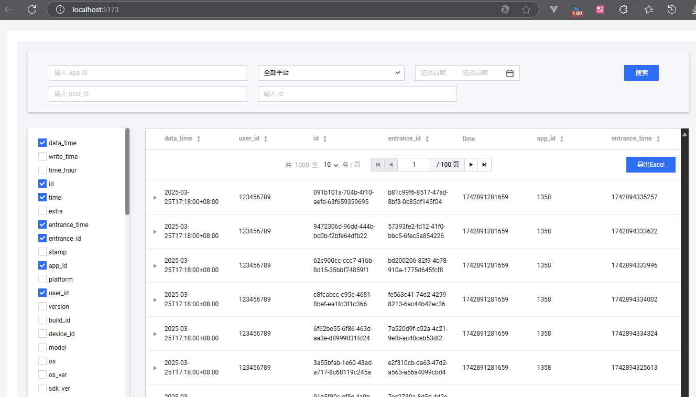
